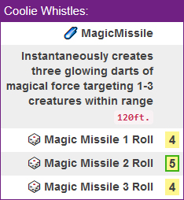
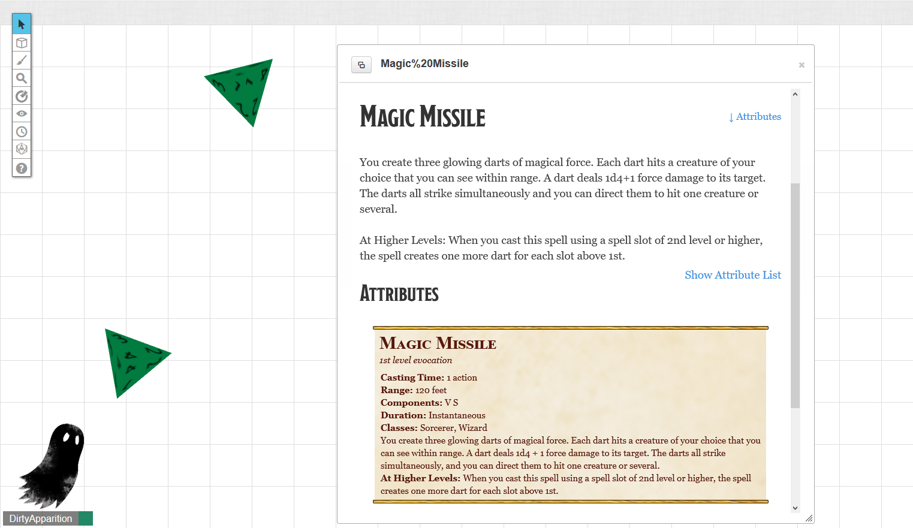
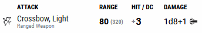
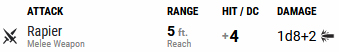
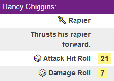

Repo for Roll20 macros for two purposes:
1. To help others
2. Backup.

Example:

Magic Missile with a different roll for each missile. The "☄️ Magic Missile" line is actually clickable and brings up a window
for anyone in the game to click to view more about the spell directly from the Roll20 compendium:

There is an example weapon and spell macro below the generic ones in the "Generic Macros" file so you can see an example of 
what to fill in. 

You will also need to look at the hit modifier on your personal character sheet to input the correct rolls on the dice section. 
You will be adapting each section to your character except the "&{template:default}" which you will need to leave exactly 
the way it is.

Each macro begins with "&{template:default}".

**Example: my Wizard's light crossbow has a modifier of +3 to hit:**

``&{template:default} {{name=Coolie Whistles:}} {{🏹 [Light Crossbow](https://roll20.net/compendium/dnd5e/Items:Light%20Crossbow#h-Light%20Crossbow)}} {{Carefully aims his light crossbow}}{{🎲 Attack Hit Roll=[[1d20+3]]}} {{🎲 Damage Roll=[[1d8+1]]}}``

So the dice is input as "**1d20+3**" (one 20-sided dice rolled and add 3 to it). Damage is rolled separately and is 
"**1d8+1**" (one 8-sided dice and add 1 to it).

**Here we see that the rapier my Bard is holding has a modifier of +4 to hit.**

``&{template:default} {{name=Dandy Chiggins:}} {{🗡️ [Rapier](https://roll20.net/compendium/dnd5e/Rapier#content)}} {{Thrusts his rapier forward.}} {{🎲 Attack Hit Roll=[[1d20+4]]}} {{🎲 Damage Roll=[[1d8+2]]}}``

So the dice for a hit roll is "**1d20+4**". Which is one 20-sided dice, plus 4 due to the hit modifier. The damage 
shows as "**1d8+2**" which is one 8-sided dice plus 2 for damage modifier with dex. Since it is a finesse weapon, it can 
use dex or str. Whichever is higher.

