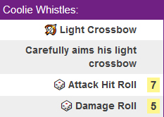

Repo for Roll20 macros for two purposes:
1. To help others
2. Backup.

Example macros:

Magic Missile with a different roll for each missile. The "☄️ Magic Missile" line is actually clickable and brings up a window
for anyone in the game to click to view more about the spell directly from the Roll20 compendium:

There is an example weapon and spell macro below the generic ones in the "Generic Macros" file so you can see an example of 
what to fill in. 

You will also need to look at the hit modifier on your personal character sheet to input the correct rolls on the dice section. 
You will be adapting each section to your character except the "&{template:default}" which you will need to leave exactly 
the way it is.

Each macro begins with "&{template:default}".

(Example: my wizard's light crossbow has a modifier of +3 to hit. 

So the dice is input as "1d20+3" (one 20-sided dice rolled and add 3 to it). Damage is rolled separately and is 
"1d8+1" (one 8-sided dice and add 1 to it). Your character may have a hit modifier of let's say 1. So it would be
"1d20+1" instead.
